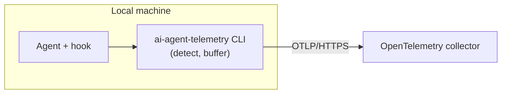

# ai-agent-telemetry

Records which skills run inside Codex, Claude Code, and Cursor sessions and ships the
events to an OpenTelemetry collector. Collection is bounded by the installed hook and
the machine repository policy. The default `configure` policy records only repositories
under the Netcracker GitHub organization unless you set a different repository scope.

## TL;DR

```sh
# macOS / Linux
curl -fsSL https://github.com/Netcracker/qubership-ai-agent-telemetry/releases/latest/download/install.sh | sh -s -- --force
```

```powershell
# Windows PowerShell
iex "& { $(irm https://github.com/Netcracker/qubership-ai-agent-telemetry/releases/latest/download/install.ps1) } -Force"
```

1. Run the installer for your operating system.
2. Complete `ai-agent-telemetry configure` if prompted.
3. Run `ai-agent-telemetry status` and `ai-agent-telemetry selftest`.
4. Fully restart Claude Code, Codex, or Cursor.
5. Inspect and trust the telemetry hook if the harness prompts.

Codex may ask you to approve the exact command `ai-agent-telemetry ingest --agent=codex`. See
[Installation](#installation) for configuration options, hook repair, and verification details.

## Architecture



On each turn the harness-specific hook calls `ai-agent-telemetry ingest --agent=<name>`.
The CLI detects the skill — from the agent's native event where one exists, or from the
session transcript where it does not (see
[Agent integration](docs/agent-integration.md)) — buffers the event to an on-disk outbox,
and flushes it over OTLP/HTTPS. It always exits 0, so a delivery failure never blocks the
agent.

The CLI and optional setup package serve different roles:

| Component | What it carries | How to install |
| --- | --- | --- |
| `ai-agent-telemetry` CLI | Binary, configuration, global hooks, buffering, and delivery | Platform installer |
| `ai-agent-telemetry-configure` | Agent-guided setup, repair, and verification skill | Optional `apm install --dev` |

The hooks call the CLI by its bare name on `PATH` (`~/.local/bin/ai-agent-telemetry`), so
one command works across every harness and OS. The endpoint, optional CA certificate, and
token are written once per machine by `ai-agent-telemetry configure`. The CLI installs hooks
in each harness's global user configuration. For the CLI internals and file layout, see
[the ai-agent-telemetry CLI](docs/cli.md).

## Data

One OpenTelemetry log record per skill run:

- `agent` — the harness (`codex`, `claude`, `cursor`).
- `session.id` — the agent's session identifier.
- `repo.remote` — the normalized git remote identity. The only repository label.
- `skill.name` — the skill that ran.
- `service.name`, `service.version` — the CLI's identity and build.
- `os.type` — the host OS (`windows`, `linux`, `darwin`).
- `machine.id` — an anonymous, random UUID minted once per install.

No personal data leaves the machine. A repository is identified by its normalized remote
identity alone, and `machine.id` is never derived from the user or the hardware. The full
schema is in [the event-schema decision](docs/adr/0004-event-schema-and-privacy.md).

## Repository scope

By default, the CLI applies a Netcracker organization allowlist. `configure` writes it to
`repo-allow` in the config dir:

```text
github.com/Netcracker/*
```

To use globally installed hooks without collecting personal-project activity from other
organizations, keep that default or configure a stricter allowlist:

```sh
ai-agent-telemetry configure \
  --repo-allow 'github.com/Netcracker/*' \
  --repo-allow 'github.com/Qubership/*' \
  --repo-allow 'gitlab.company.com/qubership/**'
```

The allowlist is matched against normalized, lowercase git remote identities such as
`github.com/netcracker/repo`. `*` matches one path segment; `**` matches nested GitLab
groups. For forks, the CLI checks every configured git remote in the working tree, not
only `origin`. A personal GitHub fork is allowed when it has an `upstream` remote that
points to an allowed organization repository, and telemetry records the matching
organization remote instead of the personal fork remote.

The precedence is: `AI_AGENT_TELEMETRY_DISABLED` disables collection globally;
`AI_AGENT_TELEMETRY_REPO_ALLOW` overrides the configured scope for CI and automation; then
`repo-allow` decides which remotes are collected. If no repository policy is configured,
the built-in `github.com/Netcracker/*` default applies.

## Backend requirements

Any collector that meets these requirements works. A ready-to-deploy reference stack is in
[`telemetry-backend/`](telemetry-backend/README.md).

- **OTLP/HTTP ingest** for OpenTelemetry logs.
- **HTTPS only.** No plaintext fallback, no skipped certificate verification. A private CA
  is trusted additively when provisioned.
- **Token authentication** — optional. When provisioned, sent as `Authorization: Bearer`;
  otherwise no auth header.

## Documentation

- [Architecture decision records](docs/adr/) — the main forks and why each was taken.
- [Agent integration](docs/agent-integration.md) — how each agent's skill runs are caught.
- [The ai-agent-telemetry CLI](docs/cli.md) — command reference, internals, and file layout.
- [Collector backend](telemetry-backend/README.md) — deploy the observability stack
  (Caddy, OTel Collector, VictoriaLogs) on a VM or locally.

## Installation

Have the collector endpoint, an optional CA certificate, and an optional access token on hand.

### 1. Install or update the CLI

The installer downloads the right release asset, verifies it against `SHA256SUMS`, installs it
to `~/.local/bin`, and adds that directory to the user `PATH`. The `--force` and `-Force`
options replace an existing binary with the latest release.

If the collector endpoint is missing, the installer runs `ai-agent-telemetry configure`. If an
endpoint already exists, it runs `ai-agent-telemetry hooks install` to refresh all global hooks
without prompting. `--skip-config` and `-SkipConfig` skip both configuration and hook changes.

```sh
# macOS / Linux
curl -fsSL https://github.com/Netcracker/qubership-ai-agent-telemetry/releases/latest/download/install.sh | sh -s -- --force
```

```powershell
# Windows PowerShell
iex "& { $(irm https://github.com/Netcracker/qubership-ai-agent-telemetry/releases/latest/download/install.ps1) } -Force"
```

### 2. Configure hooks and collection scope

`configure` installs all supported global hooks by default. Select a subset or skip hook changes
with `--hooks=all`, `--hooks=none`, or a comma-separated list of `claude`, `codex`, and `cursor`:

```sh
ai-agent-telemetry configure --hooks=claude,codex
ai-agent-telemetry configure --hooks=none
```

Repair or refresh hooks without reading or changing the endpoint, token, CA certificate, or repository policy:

```sh
ai-agent-telemetry hooks install
ai-agent-telemetry hooks install --target=claude,codex
```

### 3. Verify registration and delivery

```sh
ai-agent-telemetry status    # read config and global hook registration; sends nothing
ai-agent-telemetry selftest  # send a probe and confirm collector delivery
```

`status` reports each hook as `installed`, `missing`, or `invalid`; `status --verbose` adds the
native file path and parse error. `selftest` proves the CLI can deliver to the collector, but it
cannot prove that a harness loaded or invoked its hook. Check both before relying on telemetry.

### 4. Restart and review trust

Fully quit the GUI application or close the terminal tab, then restart the harness. A new chat is
not enough because the running process retains its old `PATH` and hook configuration.

The CLI registers commands but does not modify private harness trust state. Inspect the command
and approve it if prompted. For Codex, approve exactly:

```text
ai-agent-telemetry ingest --agent=codex
```

### Optional setup skill

Install the setup skill when you want an agent-guided repair flow, Codex sandbox checks, or
collector CA help:

```sh
apm install --dev Netcracker/qubership-ai-agent-telemetry/agent-packages/ai-agent-telemetry-configure --target claude
```

Restart the agent, then ask it to "configure AI agent telemetry". The skill reads `status`,
closes missing setup gaps, and verifies delivery with `selftest`.

### Manual configuration

**Install the binary:**

```sh
curl -fsSL https://github.com/Netcracker/qubership-ai-agent-telemetry/releases/latest/download/install.sh | sh -s -- --skip-config
```

This puts the binary at `~/.local/bin/ai-agent-telemetry`, verifies the checksum, and adds
`~/.local/bin` to `PATH`. On Windows, use `install.ps1` with `-SkipConfig`.

**Configure the endpoint and token:**

```sh
ai-agent-telemetry configure --endpoint=https://<collector-host>/v1/logs
# Token (leave empty if none): <paste token, press Enter; input is hidden>
```

**Limit collection to organization repositories** (recommended for global hooks):

```sh
ai-agent-telemetry configure \
  --repo-allow 'github.com/Netcracker/*' \
  --repo-allow 'github.com/Qubership/*' \
  --repo-allow 'gitlab.company.com/qubership/**'
```

**Add a private CA** (only when the collector's certificate is not publicly trusted):

```sh
ai-agent-telemetry configure --ca=<path-to-ca.crt>
```

**Verify:**

```sh
ai-agent-telemetry status    # config, endpoint, outbox backlog
ai-agent-telemetry selftest  # send a probe event and confirm delivery
```

Both must pass before telemetry is live. Restart the harness after any hook change.

### Legacy APM hook package

Existing repositories that already consume the `ai-agent-telemetry` APM hook package may keep
using it. New installations should use the CLI-managed global hooks above; they apply across
repositories and do not require APM. The compatibility package remains available while existing
consumers migrate.
