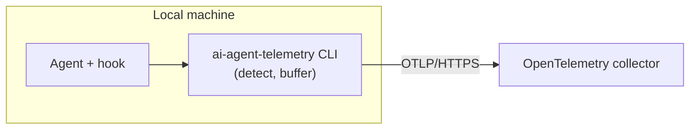

# ai-agent-telemetry

Records skill runs, command invocations, and MCP tool executions in Claude Code, Cline, Codex, and Cursor sessions.
It sends the events to an OpenTelemetry collector. Collection is bounded by the installed hook and
the machine repository policy. The default `configure` policy records only repositories
under the Netcracker GitHub organization unless you set a different repository scope.

## TL;DR

Run the installer once. It installs the CLI and configures hooks for Claude Code, Cline, Codex, and Cursor. Preflight
may prompt for missing collector settings or ask you to install or update required Git and Java tools.

```sh
# macOS / Linux
curl -fsSL https://github.com/Netcracker/qubership-ai-agent-telemetry/releases/latest/download/install.sh | sh
```

```powershell
# Windows PowerShell
powershell.exe -NoProfile -Command "& ([scriptblock]::Create((Invoke-RestMethod 'https://github.com/Netcracker/qubership-ai-agent-telemetry/releases/latest/download/install.ps1')))"
```

1. Follow any preflight prompts for collector settings or selected Git and Java prerequisites.
2. Run `ai-agent-telemetry status` and `ai-agent-telemetry selftest`.
3. If installation added the CLI directory to `PATH`, fully restart every running Cline host. Confirm that Cline Hooks
   are enabled, invoke a skill in Cline, and verify its `skill_executed` event in the telemetry backend.
4. If installation changed the Codex hook definition and hash, fully restart Codex. If prompted, inspect and approve
   `ai-agent-telemetry ingest --agent=codex`.

See [Installation](#installation) for configuration options, hook repair, and verification details.

The default lifecycle installs the complete Qubership developer baseline: APM, telemetry, and global Git hooks. See
the [lifecycle installer guide](docs/lifecycle-installer.md) for component and harness selection.

## Architecture



On each supported hook event, the harness calls `ai-agent-telemetry ingest --agent=<name>`. The CLI normalizes the
signal into a typed event, buffers it in an on-disk outbox, and flushes it over OTLP/HTTPS. Skill detection uses a
native event where available and a session transcript otherwise. See
[Agent integration](docs/agent-integration.md). Hook ingestion always exits 0, so a detection or delivery failure
never blocks the agent.

The installer puts the CLI on `PATH`, saves the machine settings, and registers hooks for all
four harnesses. Each hook calls the same bare command (`ai-agent-telemetry`) on every supported
OS. For the CLI internals and file layout, see [the ai-agent-telemetry CLI](docs/cli.md).

## Data

Each OpenTelemetry log record has an event name as its body and these common log attributes:

- `event.id` — a time-sortable event identifier that stays unchanged across delivery retries.
- `agent`: the harness (`claude`, `cline`, `codex`, or `cursor`).
- `session.id` — the agent's session identifier.
- `repo.remote` — the normalized git remote identity. The only repository label.

The process adds these resource attributes:

- `service.name`, `service.version` — the CLI's identity and build.
- `os.type` — the host OS (`windows`, `linux`, `darwin`).
- `machine.id` — an anonymous, random UUID minted once per install, when available.

The event-specific bodies and attributes are:

| Body | Required attributes | Optional attributes |
| --- | --- | --- |
| `skill_executed` | `skill.name` | None |
| `command_invoked` | `command.name`, `command.source`, `command.expansion_type` | None |
| `mcp_tool_executed` | `mcp.tool.name`, `mcp.outcome` | `mcp.server.name`, `mcp.duration_ms` |

`command.expansion_type` is `slash_command` or `mcp_prompt`. `mcp.outcome` is `succeeded`, `failed`, or `unknown`.
Durations are non-negative integer milliseconds.

External identifiers use strict ASCII profiles and are rejected rather than trimmed or rewritten:

| Fields | Length | Accepted shape |
| --- | --- | --- |
| `session.id` | 1–128 | Starts with an alphanumeric character; then alphanumerics, `.`, `_`, `:`, or `-` |
| `skill.name`, `command.name` | 1–255 | Starts with an alphanumeric character; then alphanumerics, `.`, `_`, `:`, or `-` |
| `command.source` | 1–64 | Alphanumerics, `.`, `_`, or `-` |
| `mcp.server.name`, `mcp.tool.name` | 1–128 | Alphanumerics, `.`, `_`, or `-` |

No personal data or unbounded content leaves the machine. The CLI excludes prompts and expanded prompt text, command
arguments, tool inputs and results, errors and stack traces, local and transcript paths, MCP URLs and launch commands,
tool-call and turn IDs, model identifiers, user email, and arbitrary unrecognized fields. A repository is identified
only by its normalized remote. Neither `event.id` nor `machine.id` is derived from the user or hardware.

[ADR 0004](docs/adr/0004-event-schema-and-privacy.md) records the original privacy decision. The expanded typed schema
and allowlist are in [ADR 0006](docs/adr/0006-generic-event-schema-and-privacy.md).

## Repository scope

By default, the CLI applies a Netcracker organization allowlist. `configure` writes it to
`repo-allow` in the config dir:

```text
github.com/Netcracker/*
```

To use globally installed hooks without collecting personal-project activity from other
organizations, keep that default or configure a stricter allowlist:

```sh
ai-agent-telemetry configure \
  --repo-allow 'github.com/Netcracker/*' \
  --repo-allow 'github.com/Qubership/*' \
  --repo-allow 'gitlab.company.com/qubership/**'
```

The allowlist is matched against normalized, lowercase git remote identities such as
`github.com/netcracker/repo`. `*` matches one path segment; `**` matches nested GitLab
groups. For forks, the CLI checks every configured git remote in the working tree, not
only `origin`. A personal GitHub fork is allowed when it has an `upstream` remote that
points to an allowed organization repository, and telemetry records the matching
organization remote instead of the personal fork remote.

The precedence is: `AI_AGENT_TELEMETRY_DISABLED` disables collection globally;
`AI_AGENT_TELEMETRY_REPO_ALLOW` overrides the configured scope for CI and automation; then
`repo-allow` decides which remotes are collected. If no repository policy is configured,
the built-in `github.com/Netcracker/*` default applies.

## Backend requirements

Any collector that meets these requirements works. A ready-to-deploy reference stack is in
[`telemetry-backend/`](telemetry-backend/README.md).

- **OTLP/HTTP ingest** for OpenTelemetry logs.
- **HTTPS only.** No plaintext fallback, no skipped certificate verification. A private CA
  is trusted additively when provisioned.
- **Token authentication** — optional. When provisioned, sent as `Authorization: Bearer`;
  otherwise no auth header.

## Documentation

- [Architecture decision records](docs/adr/) — the main forks and why each was taken.
- [Agent integration](docs/agent-integration.md) — how each agent's skill runs are caught.
- [The ai-agent-telemetry CLI](docs/cli.md) — command reference, internals, and file layout.
- [Collector backend](telemetry-backend/README.md) — deploy the observability stack
  (Caddy, OTel Collector, VictoriaLogs, and Grafana dashboards) on a VM or locally.

## Installation

Have the collector endpoint, an optional CA certificate, and an optional access token on hand.

### 1. Install the baseline

The bootstrap downloads and verifies the correct release, then runs `ai-agent-telemetry install`. The lifecycle
installs the managed CLI in `~/.local/bin`, adds the directory to the user `PATH` when needed, and installs all
components and harnesses by default. It prompts for missing collector settings and, when global Git hooks are
selected, for missing Git or Java 21 prerequisites.

```sh
# macOS / Linux
curl -fsSL https://github.com/Netcracker/qubership-ai-agent-telemetry/releases/latest/download/install.sh | sh
```

```powershell
# Windows PowerShell
powershell.exe -NoProfile -Command "& ([scriptblock]::Create((Invoke-RestMethod 'https://github.com/Netcracker/qubership-ai-agent-telemetry/releases/latest/download/install.ps1')))"
```

Select components with `--components`, subtract components with `--skip`, and select harnesses with `--harnesses`:

```sh
curl -fsSL https://github.com/Netcracker/qubership-ai-agent-telemetry/releases/latest/download/install.sh \
  | sh -s -- --components apm,telemetry --harnesses claude,codex
```

For unattended telemetry installation, set `AI_AGENT_TELEMETRY_ENDPOINT` and the optional
`AI_AGENT_TELEMETRY_TOKEN`, then pass `--non-interactive`. A missing endpoint fails before the managed CLI or any
component changes.

### Update or remove the installation

Update the CLI and all selected components with `ai-agent-telemetry update`. Use `update --cli-only` when you want to
update only the managed CLI. CLI-only mode cannot be combined with component, skip, harness, Git-hook, or
noninteractive options.

`ai-agent-telemetry uninstall` removes all components and the managed CLI. A partial selection preserves the CLI
unless you pass `--remove-cli`; that flag requires telemetry in the final selection. Normal uninstall preserves
telemetry configuration, credentials, buffered events, offsets, diagnostics, and machine identity. Add `--purge` to
remove the telemetry-specific configuration and cache after hook cleanup.

On Windows, run full uninstall or partial uninstall with `--remove-cli` through the temporary bootstrap:

```powershell
powershell.exe -NoProfile -Command "& ([scriptblock]::Create((Invoke-RestMethod 'https://github.com/Netcracker/qubership-ai-agent-telemetry/releases/latest/download/install.ps1'))) uninstall --purge"
powershell.exe -NoProfile -Command "& ([scriptblock]::Create((Invoke-RestMethod 'https://github.com/Netcracker/qubership-ai-agent-telemetry/releases/latest/download/install.ps1'))) uninstall --components telemetry --remove-cli"
```

The installer reverses only the `PATH` change recorded by its ownership receipt. It never removes `~/.local/bin`, even
when that directory is empty.

### 2. Verify registration and delivery

```sh
ai-agent-telemetry status    # read config and global hook registration; sends nothing
ai-agent-telemetry selftest  # send a probe and confirm collector delivery
```

`status` reports each hook as `installed`, `missing`, `outdated`, or `invalid`; `status --verbose` adds the
native file path and diagnostic. A Cline hook is `outdated` only when it exactly matches a supported legacy template.
`selftest` proves the CLI can deliver to the collector, but it cannot prove that a harness loaded or invoked its hook.
Check both before relying on telemetry.

### 3. Activate and verify Cline

If installation added the CLI directory to `PATH`, fully restart every running Cline host, including VS Code or a
JetBrains IDE. A process that started before the `PATH` change cannot find the managed CLI. Confirm that the Cline Hooks
setting is enabled, invoke a skill in Cline, and verify a matching `skill_executed` event with `agent=cline` in the
telemetry backend. Filter by the Cline session, skill name, and invocation time when other sessions are active.

`status` verifies the managed hook file, and `selftest` verifies transport. Only the real event check proves that Cline
loaded and invoked the hook.

### 4. Restart Codex after a hook change

If installation or hook refresh changed the Codex hook definition and hash, fully restart Codex. A new chat is not
enough. The CLI does not edit Codex's private trust state, so inspect and approve exactly this command if prompted:

```text
ai-agent-telemetry ingest --agent=codex
```

### Advanced hook selection and repair

Normal installation configures all supported harnesses, even if some are not installed yet. To
select a subset or skip hook changes, use `--hooks=all`, `--hooks=none`, or a comma-separated list:

```sh
ai-agent-telemetry configure --hooks=claude,codex
ai-agent-telemetry configure --hooks=none
```

To repair hooks without changing the collector settings or repository policy, run:

```sh
ai-agent-telemetry hooks install
ai-agent-telemetry hooks install --target=claude,codex
```

Cline uses one global file hook for its VS Code and JetBrains extensions, compatible VS Code hosts such as Cursor,
and Cline CLI. On macOS and Linux, the installer manages `~/Documents/Cline/Hooks/PostToolUse`; on Windows, it manages
`~/Documents/Cline/Hooks/PostToolUse.ps1`. Installation creates only a missing path; any existing entry other than the
exact current template is preserved as a conflict. Uninstall deletes only an exact current or supported legacy
template. An exact legacy template appears as `outdated`; replace it with the commands reported by
`status --verbose`. A mismatched file with the telemetry ownership comment blocks the remaining telemetry cleanup until
the user follows the [manual conflict-resolution procedure](docs/manual-uninstall.md). The hook exits successfully with
no stdout or stderr. This removes telemetry output from Cline's hook card, but Cline still displays its own
`Hook: PostToolUse` status. Cline 4.1.4 has no separate setting to hide that status while keeping the hook enabled.
Cline skill deployment maps to APM's `agent-skills` target. The same hook records completed MCP tool calls with exact
server and tool names, success or failure, and duration when Cline supplies it. Cline command invocations remain
unsupported because the available hook runs after Cline replaces the command token with its expanded instructions.

See [the Cline harness decision](docs/adr/0007-cline-harness-support.md) and
[the hook lifecycle decision](docs/adr/0008-cline-hook-installation-and-removal.md) for the client scope and trade-offs.
[The Cline MCP decision](docs/adr/0009-cline-mcp-tool-telemetry.md) defines MCP identity and outcome handling.

### Optional setup skill

Install the setup skill when you want an agent-guided repair flow or collector CA help:

```sh
apm install --dev Netcracker/qubership-ai-agent-telemetry/agent-packages/ai-agent-telemetry-configure --target claude
```

Restart the agent, then ask it to "configure AI agent telemetry". The skill reads `status`,
closes missing setup gaps, and verifies delivery with `selftest`.

### Advanced manual setup

Use this path when machine configuration must be applied separately, for example in automation.

**Install the CLI without telemetry:**

```sh
curl -fsSL https://github.com/Netcracker/qubership-ai-agent-telemetry/releases/latest/download/install.sh \
  | sh -s -- --skip telemetry
```

This installs the managed CLI and the remaining selected components without changing telemetry configuration or
native telemetry hooks. Use the same lowercase, double-dash options with `install.ps1` on Windows.

**Configure the endpoint and token:**

```sh
ai-agent-telemetry configure --endpoint=https://<collector-host>/v1/logs
# Token (leave empty if none): <paste token, press Enter; input is hidden>
```

**Tune local delivery buffering** (optional):

```sh
ai-agent-telemetry configure --buffer-cap=1000 --flush-timeout=30s
```

The defaults remain 100 buffered events and a 2-second ordinary flush timeout. Run
`ai-agent-telemetry status --verbose` to inspect the effective values.

**Limit collection to organization repositories** (recommended for global hooks):

```sh
ai-agent-telemetry configure \
  --repo-allow 'github.com/Netcracker/*' \
  --repo-allow 'github.com/Qubership/*' \
  --repo-allow 'gitlab.company.com/qubership/**'
```

**Add a private CA** (only when the collector's certificate is not publicly trusted):

```sh
ai-agent-telemetry configure --ca=<path-to-ca.crt>
```

Return to [Verify registration and delivery](#2-verify-registration-and-delivery). If the change refreshed the Codex
hook definition and hash, fully restart Codex and approve the telemetry hook if prompted.

### Legacy APM hook package

Before it writes CLI-managed hooks, the CLI checks the global APM manifest at `~/.apm/apm.yml` for this exact legacy
dependency: `Netcracker/qubership-ai-agent-telemetry/agent-packages/ai-agent-telemetry`. If it finds the dependency, it
asks APM to uninstall it globally. Cleanup is best effort: a failure produces a warning, but the CLI still
canonicalizes the requested native hooks. The command succeeds when configuration and hook installation succeed.

Automatic cleanup reads only the global APM manifest. It does not edit project manifests. Existing repositories that
consume the `ai-agent-telemetry` APM hook package may keep using it while they migrate. The compatibility package
remains available for those repository-local consumers, while the machine-wide setup above is the default for new
installations.
