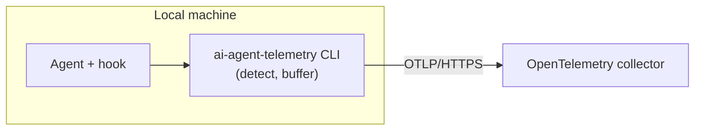

# ai-agent-telemetry

Records skill runs, command invocations, and MCP tool executions in Codex, Claude Code, and Cursor sessions, then
ships the events to an OpenTelemetry collector. Collection is bounded by the installed hook and
the machine repository policy. The default `configure` policy records only repositories
under the Netcracker GitHub organization unless you set a different repository scope.

## TL;DR

Run the installer once. It installs the CLI and configures hooks for Claude Code, Codex,
and Cursor. If prompted, enter the collector endpoint and optional token.

```sh
# macOS / Linux
curl -fsSL https://github.com/Netcracker/qubership-ai-agent-telemetry/releases/latest/download/install.sh | sh -s -- --force
```

```powershell
# Windows PowerShell
iex "& { $(irm https://github.com/Netcracker/qubership-ai-agent-telemetry/releases/latest/download/install.ps1) } -Force"
```

1. If prompted, enter the collector endpoint and optional token.
2. Run `ai-agent-telemetry status` and `ai-agent-telemetry selftest`.
3. Fully restart your harness, then review or approve the hook if prompted.

See [Installation](#installation) for configuration options, hook repair, and verification details.

To install the broader Qubership developer baseline, see the
[Qubership developer installer](global-scripts/README.md). It is separate from the telemetry-only installer above.

## Architecture



On each supported hook event, the harness calls `ai-agent-telemetry ingest --agent=<name>`. The CLI normalizes the
signal into a typed event, buffers it in an on-disk outbox, and flushes it over OTLP/HTTPS. Skill detection uses a
native event where available and a session transcript otherwise. See
[Agent integration](docs/agent-integration.md). The CLI always exits 0, so a detection or delivery failure never
blocks the agent.

The installer puts the CLI on `PATH`, saves the machine settings, and registers hooks for all
three harnesses. Each hook calls the same bare command (`ai-agent-telemetry`) on every supported
OS. For the CLI internals and file layout, see [the ai-agent-telemetry CLI](docs/cli.md).

## Data

Each OpenTelemetry log record has an event name as its body and these common log attributes:

- `agent` — the harness (`codex`, `claude`, `cursor`).
- `session.id` — the agent's session identifier.
- `repo.remote` — the normalized git remote identity. The only repository label.

The process adds these resource attributes:

- `service.name`, `service.version` — the CLI's identity and build.
- `os.type` — the host OS (`windows`, `linux`, `darwin`).
- `machine.id` — an anonymous, random UUID minted once per install, when available.

The event-specific bodies and attributes are:

| Body | Required attributes | Optional attributes |
| --- | --- | --- |
| `skill_executed` | `skill.name` | None |
| `command_invoked` | `command.name`, `command.source`, `command.expansion_type` | None |
| `mcp_tool_executed` | `mcp.tool.name`, `mcp.outcome` | `mcp.server.name`, `mcp.duration_ms` |

`command.expansion_type` is `slash_command` or `mcp_prompt`. `mcp.outcome` is `succeeded`, `failed`, or `unknown`.
Durations are non-negative integer milliseconds.

External identifiers use strict ASCII profiles and are rejected rather than trimmed or rewritten:

| Fields | Length | Accepted shape |
| --- | --- | --- |
| `session.id` | 1–128 | Starts with an alphanumeric character; then alphanumerics, `.`, `_`, `:`, or `-` |
| `skill.name`, `command.name` | 1–255 | Starts with an alphanumeric character; then alphanumerics, `.`, `_`, `:`, or `-` |
| `command.source` | 1–64 | Alphanumerics, `.`, `_`, or `-` |
| `mcp.server.name`, `mcp.tool.name` | 1–128 | Alphanumerics, `.`, `_`, or `-` |

No personal data or unbounded content leaves the machine. The CLI excludes prompts and expanded prompt text, command
arguments, tool inputs and results, errors and stack traces, local and transcript paths, MCP URLs and launch commands,
tool-call and turn IDs, model identifiers, user email, and arbitrary unrecognized fields. A repository is identified
only by its normalized remote, and `machine.id` is never derived from the user or hardware.

[ADR 0004](docs/adr/0004-event-schema-and-privacy.md) records the original privacy decision. The expanded typed schema
and allowlist are in [ADR 0006](docs/adr/0006-generic-event-schema-and-privacy.md).

## Repository scope

By default, the CLI applies a Netcracker organization allowlist. `configure` writes it to
`repo-allow` in the config dir:

```text
github.com/Netcracker/*
```

To use globally installed hooks without collecting personal-project activity from other
organizations, keep that default or configure a stricter allowlist:

```sh
ai-agent-telemetry configure \
  --repo-allow 'github.com/Netcracker/*' \
  --repo-allow 'github.com/Qubership/*' \
  --repo-allow 'gitlab.company.com/qubership/**'
```

The allowlist is matched against normalized, lowercase git remote identities such as
`github.com/netcracker/repo`. `*` matches one path segment; `**` matches nested GitLab
groups. For forks, the CLI checks every configured git remote in the working tree, not
only `origin`. A personal GitHub fork is allowed when it has an `upstream` remote that
points to an allowed organization repository, and telemetry records the matching
organization remote instead of the personal fork remote.

The precedence is: `AI_AGENT_TELEMETRY_DISABLED` disables collection globally;
`AI_AGENT_TELEMETRY_REPO_ALLOW` overrides the configured scope for CI and automation; then
`repo-allow` decides which remotes are collected. If no repository policy is configured,
the built-in `github.com/Netcracker/*` default applies.

## Backend requirements

Any collector that meets these requirements works. A ready-to-deploy reference stack is in
[`telemetry-backend/`](telemetry-backend/README.md).

- **OTLP/HTTP ingest** for OpenTelemetry logs.
- **HTTPS only.** No plaintext fallback, no skipped certificate verification. A private CA
  is trusted additively when provisioned.
- **Token authentication** — optional. When provisioned, sent as `Authorization: Bearer`;
  otherwise no auth header.

## Documentation

- [Architecture decision records](docs/adr/) — the main forks and why each was taken.
- [Agent integration](docs/agent-integration.md) — how each agent's skill runs are caught.
- [The ai-agent-telemetry CLI](docs/cli.md) — command reference, internals, and file layout.
- [Collector backend](telemetry-backend/README.md) — deploy the observability stack
  (Caddy, OTel Collector, VictoriaLogs) on a VM or locally.

## Installation

Have the collector endpoint, an optional CA certificate, and an optional access token on hand.

### 1. Install or update the CLI

The installer downloads and verifies the right release, puts it in `~/.local/bin`, and adds that
directory to the user `PATH`. On a new machine, it prompts only for missing collector settings and
registers all three hooks. On upgrade, it refreshes the hooks without prompting for those settings
again. The `--force` and `-Force` options replace an existing binary with the latest release.

```sh
# macOS / Linux
curl -fsSL https://github.com/Netcracker/qubership-ai-agent-telemetry/releases/latest/download/install.sh | sh -s -- --force
```

```powershell
# Windows PowerShell
iex "& { $(irm https://github.com/Netcracker/qubership-ai-agent-telemetry/releases/latest/download/install.ps1) } -Force"
```

### 2. Verify registration and delivery

```sh
ai-agent-telemetry status    # read config and global hook registration; sends nothing
ai-agent-telemetry selftest  # send a probe and confirm collector delivery
```

`status` reports each hook as `installed`, `missing`, or `invalid`; `status --verbose` adds the
native file path and parse error. `selftest` proves the CLI can deliver to the collector, but it
cannot prove that a harness loaded or invoked its hook. Check both before relying on telemetry.

### 3. Restart and review trust

Fully quit the GUI application or close the terminal tab, then restart the harness. A new chat is
not enough because the running process retains its old `PATH` and hook configuration.

The CLI registers commands but does not modify private harness trust state. Inspect the command
and approve it if prompted. For Codex, approve exactly:

```text
ai-agent-telemetry ingest --agent=codex
```

### Advanced hook selection and repair

Normal installation configures all supported harnesses, even if some are not installed yet. To
select a subset or skip hook changes, use `--hooks=all`, `--hooks=none`, or a comma-separated list:

```sh
ai-agent-telemetry configure --hooks=claude,codex
ai-agent-telemetry configure --hooks=none
```

To repair hooks without changing the collector settings or repository policy, run:

```sh
ai-agent-telemetry hooks install
ai-agent-telemetry hooks install --target=claude,codex
```

### Optional setup skill

Install the setup skill when you want an agent-guided repair flow or collector CA help:

```sh
apm install --dev Netcracker/qubership-ai-agent-telemetry/agent-packages/ai-agent-telemetry-configure --target claude
```

Restart the agent, then ask it to "configure AI agent telemetry". The skill reads `status`,
closes missing setup gaps, and verifies delivery with `selftest`.

### Advanced manual setup

Use this path when binary installation and machine configuration must happen as separate steps,
for example in automation.

**Install the binary:**

```sh
curl -fsSL https://github.com/Netcracker/qubership-ai-agent-telemetry/releases/latest/download/install.sh | sh -s -- --skip-config
```

This puts the binary at `~/.local/bin/ai-agent-telemetry`, verifies the checksum, and adds
`~/.local/bin` to `PATH`. On Windows, use `install.ps1` with `-SkipConfig`.

**Configure the endpoint and token:**

```sh
ai-agent-telemetry configure --endpoint=https://<collector-host>/v1/logs
# Token (leave empty if none): <paste token, press Enter; input is hidden>
```

**Tune local delivery buffering** (optional):

```sh
ai-agent-telemetry configure --buffer-cap=1000 --flush-timeout=30s
```

The defaults remain 100 buffered events and a 2-second ordinary flush timeout. Run
`ai-agent-telemetry status --verbose` to inspect the effective values.

**Limit collection to organization repositories** (recommended for global hooks):

```sh
ai-agent-telemetry configure \
  --repo-allow 'github.com/Netcracker/*' \
  --repo-allow 'github.com/Qubership/*' \
  --repo-allow 'gitlab.company.com/qubership/**'
```

**Add a private CA** (only when the collector's certificate is not publicly trusted):

```sh
ai-agent-telemetry configure --ca=<path-to-ca.crt>
```

Return to [Verify registration and delivery](#2-verify-registration-and-delivery), then restart the
harness after any hook change.

### Legacy APM hook package

Existing repositories that already consume the `ai-agent-telemetry` APM hook package may keep
using it. The machine-wide setup above is the default for new installations. The compatibility
package remains available while existing consumers migrate.
